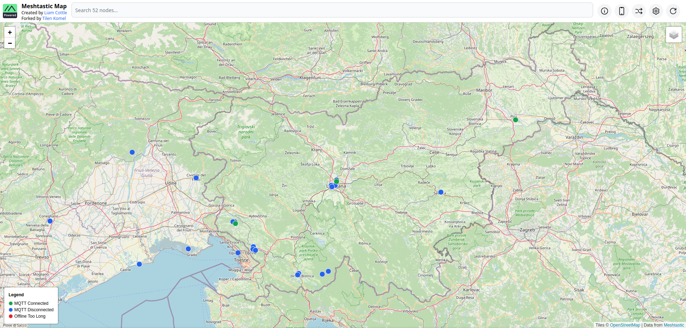

**Created by:** Liam Cottle\
**Forked by:** Tilen Komel\
**Forked by:** Niccolò Malenotti
<h2 align="center">Meshtastic Map</h2>

A map of all Meshtastic nodes heard via MQTT.

My version of the map is available at https://mappa.niccomale.it



## How does it work?

- An [mqtt client](./src/mqtt.js) is persistently connected to `mqtt.niccomale.it` and subscribed to the `msh/#` topic.
- All messages received are attempted to be decoded as [ServiceEnvelope](https://buf.build/meshtastic/protobufs/docs/main:meshtastic#meshtastic.ServiceEnvelope) packets.
- If a packet is encrypted, it attempts to decrypt it with the default `AQ==` key.
- If a packet can't be decoded as a `ServiceEnvelope`, it is ignored.
- `NODEINFO_APP` packets add a node to the database.
- `POSITION_APP` packets update the position of a node in the database.
- `NEIGHBORINFO_APP` packets log neighbours heard by a node to the database.
- `TELEMETRY_APP` packets update battery and voltage metrics for a node in the database.
- `TRACEROUTE_APP` packets log all trace routes performed by a node to the database.
- `MAP_REPORT_APP` packets are stored in the database, but are not widely adopted, so are not used yet.
- The database is a MySQL server, and a nodejs express server is running an API to serve data to the map interface.

## Features

- [x] Connects to mqtt.meshtastic.org to collect nodes and metrics.
- [x] Shows nodes on the map if they have reported a valid position.
- [x] Search bar to find nodes by ID, Hex ID, Short Name and Long Name.
- [x] Hover over nodes on the map to see basic information and a preview image.
- [x] Click nodes on the map to show a sidebar with more info such as telemetry graphs and traceroutes.
- [x] Ability to share a direct link to a node. The map will auto navigate to it.
- [x] Device list. To see which hardware models are most popular.
- [x] Mobile optimised layout.
- [x] Settings available to hide nodes from the map if they haven't been updated in a while.
- [x] Real-Time message UI to view `TEXT_MESSAGE_APP` packets as they come in.
- [x] View position history of a node between a selectable time range.
- [x] "Neighbours" map layer. Shows blue connection lines between nodes that heard the other node.
  - This information is taken from the `NEIGHBORINFO_APP`.
  - Some neighbour lines are clearly wrong.
  - Meshtastic firmware older than [v2.3.2](https://github.com/meshtastic/firmware/releases/tag/v2.3.2.63df972) reports MQTT nodes as Neighbours.
  - This was fixed in [meshtastic/firmware/#3457](https://github.com/meshtastic/firmware/pull/3457), but adoption will likely be slow...

## Dev

Clone the project repo:

```
git clone https://github.com/folletto95/meshtastic-map-ITA
cd meshtastic-map
```

Build Docker images:

```
docker compose -f docker-compose.dev.yaml build
```

Update environment variables:

```
nano docker-compose.yaml
```

ENV lists:

- [MQTT](./mqtt/src/settings.ts)
- [API](./api/src/settings.ts)
- [APP](./app/index.js)

Run:

```
docker compose -f docker-compose.dev.yaml up
```

> [!NOTE]
> Use the modern `docker compose` plugin. The legacy `docker-compose`
> Python package can crash with `KeyError: 'ContainerConfig'` when it tries to
> recreate the MariaDB container. If you accidentally launched the stack with
> the legacy CLI, stop it and remove the stale containers before retrying:
>
> ```
> docker-compose down --volumes --remove-orphans
> ```

## Run

Clone the project repo:

```
git clone https://github.com/folletto95/meshtastic-map-ITA
cd meshtastic-map
```

Build Docker images:

```
docker compose build
```

Update environment variables:

```
nano docker-compose.yaml
```

ENV lists:

- [MQTT](./mqtt/src/settings.ts)
- [API](./api/src/settings.ts)
- [APP](./app/index.js)

Run:

```
docker compose up
```

> [!NOTE]
> Use the modern `docker compose` plugin. The legacy `docker-compose`
> Python package can crash with `KeyError: 'ContainerConfig'` when it tries to
> recreate the MariaDB container. If you accidentally launched the stack with
> the legacy CLI, stop it and remove the stale containers before retrying:
>
> ```
> docker-compose down --volumes --remove-orphans
> ```

## Updating

You can just `git pull` or pull new image from Docekr Hub. Migrations will handle DB update.

## Testing

To execute unit tests, run the following;

```
npm run test
```

## Contributing

If you have a feature request, or find a bug, please [open an issue](https://github.com/folletto95/meshtastic-map-ITA/issues) here on GitHub.

## License

MIT

## Legal

This project is not affiliated with or endorsed by the Meshtastic project.
The Meshtastic logo is the trademark of Meshtastic LLC.

THE SOFTWARE IS PROVIDED “AS IS”, WITHOUT WARRANTY OF ANY KIND, EXPRESS OR IMPLIED, INCLUDING BUT NOT LIMITED TO THE WARRANTIES OF MERCHANTABILITY, FITNESS FOR A PARTICULAR PURPOSE AND NONINFRINGEMENT. IN NO EVENT SHALL THE AUTHORS OR COPYRIGHT HOLDERS BE LIABLE FOR ANY CLAIM, DAMAGES OR OTHER LIABILITY, WHETHER IN AN ACTION OF CONTRACT, TORT OR OTHERWISE, ARISING FROM, OUT OF OR IN CONNECTION WITH THE SOFTWARE OR THE USE OR OTHER DEALINGS IN THE SOFTWARE.
